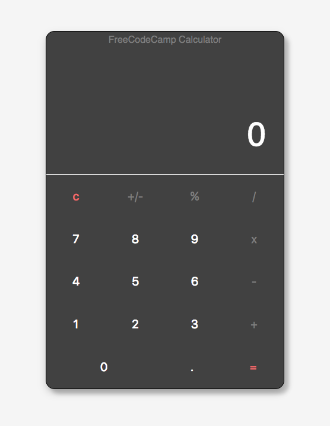

# FreeCodeCamp Calculator

## A freeCodeCamp Front-End Project

---

### Description:

Simple Calculator App

---

### Requirements/User-Stories

* User Story: I can add, subtract, multiply, and divide by two numbers.
* User Story: I can clear the input field with a clear button.
* User Story: I can keep chaining mathematical operations together until I hit the equal button, and the calculator will tell me the correct output.  

* Challenge: I took it as a challenge to build this app using [React](https://facebook.github.io/react/)
* Styled-Components: Used the [Styled-Components](https://github.com/styled-components/styled-components) library to style the app, try it out!
* Design: Found some inspiration for the design on [Dribble](https://dribbble.com/shots/3467471-DailyUI-004-Calculator) and implemented it on this app.
* Create-React-App: Used [Create-React-App](https://github.com/facebookincubator/create-react-app) to get the react app up and running and to easily deploy online.
---

### Links

Personal Site [sergdev.com](https://sergdev.com/)

[FreeCodeCamp](https://www.freecodecamp.com/sergrdz7)

[Demo](https://sergrdz7.github.io/fcc-calculator/)

